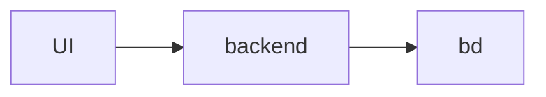

# Projeto de entrevistas: **pontos-web**

## qual a expectativa?

CRUD completo envolvendo a tabela **Produtos**

- listagem
- formulário para inserção/alteração de dados
- remover registros

## quais os entregáveis?

- projeto .NET MVC
- banco de dados

## como envio meu código?

1. clone esse repo no seu ambiente local
2. crie uma branch com seu nome (ex: feature/meu-nome)
3. ao finalizar o desenvolvimento local, faça o push para sua branch no origin
4. abra um `merge request` da sua branch para a master

## qual a estrutura de dados?

### Tabela: Categorias

| CategoriaId | Nome |
| ------ | ------ |
| 1 | Recicláveis |
| 2 | Eletrônicos |

### Tabela: Produtos
| ProdutoId | Nome | Pontos | CategoriaId |
| ------ | ------ | ------ | ------ |
| 1 | Vidro |10|1|
| 2 | Papelão |8|1|
| 3 | Laptop |200|2|
| 4 | Celular |150|2|

Relacionamento 1:n, ou seja, produto tem 1 categoria, 1 categoria tem n produtos

## alguma observação?

- Não é necessário fazer nenhuma entrega de tela em relação a **tabela de categorias**

- Como executar - Romulo 

Projeto criado usando Code First com migrations, para gerar banco digite update-database no package manager, mais informações: https://docs.microsoft.com/pt-br/ef/core/managing-schemas/migrations/,
qualquer duvida estou a disposição
